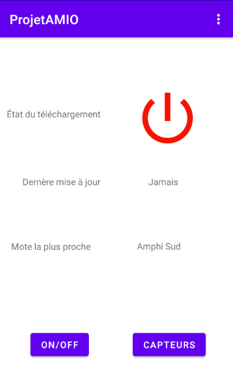
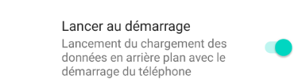

# Projet android

Le but principal de cette application est de : 
- lister dans l'activité principale les capteurs actifs et les valeurs de luminosité qu'ils relèvent,en mettant en évidence ceux qui indiquent la présence d'une lumière active
- émettre une notification si une nouvelle lumière vient d'être allumée en semaine entre **19h** et **23h**, en spécifiant le capteur impliqué
- envoyer un email si cet événement survient le week-end entre **19h** et **23h** ou en semaine entre **23h** et **6h**.
- permettre la configuration des plages horaires et de l'adresse email dans un menu dédié

# Fonctionnement de l'application 

L'application se découpe en 3 menus principaux : 
- Le menu d'accueil,
- Le menu de paramétrage,
- La liste des capteurs.

# Menu d'accueil

Une fois l'application lancée, vous arrivez sur un menu d'accueil.

  

Ce menu donne un résumé des principales fonction de l'application telles que : 
- L'état du téléchargement (Avec un voyant rouge s'il est désactivé, vert s'il est activé),
- La date de dernière mise à jour, qui correspond à la dernière date de reception de données des capteurs de l'API,
- La mote la plus proche, ou le capteur le plus proche, qui indique celui qui est le plus proche du téléphone (nécessite que l'application accède à la position GPS).

  

Cette capture illustre un téléchargement inactif.

Un bouton on/off permet l'activation ou la desactivation du téléchargement des données.
Un bouton capteur redirige vers les différents capteurs et les mesures associées.

  

Il est possible de définir des réglages en haut à droite en cliquant sur les 3 points.

  

# Réglages de l'application

Parmi les réglages proposés, voici les éléments importants : 

  

Une option qui permet de lancer l'application au démarrage du téléphone.  

  

Les réglages sur les notifications, notamment l'activations de celles-ci et une plage d'activation définie par une heure de début et une heure de fin à définir.

  

Enfin les réglages des notifications par email, qui fonctionne du même principe que les notifications, avec une plage horaire qui varie en fonction du jour (en semaine / en week-end)

# Affichage des valeurs des capteurs

Pour afficher les dernières valeurs, il faut cliquer sur le bouton capteur.
Celui redirige vers une liste de capteurs avec leurs états.

  

Par exemple, sur ce capteur, nous pouvons voir plusieurs informations :
- Le nom du capteur, ici Bureau 2.6,
- La température, ici -39.6°C (température idéal pour conserver le vaccin du covid-19),
- L'humidité, qui est de 25.81% sur l'exemple,
- La batterie du capteur, de 1% dans l'exemple,
- Et la dernière date de reception d'une donnée du capteur, qui est du 18 Décembre 2020 à 19:44 d'après l'image,
- La luminosité est représentée par l'icone de lampe, qui s'allume en jaune au dessus d'un certain seuil.
